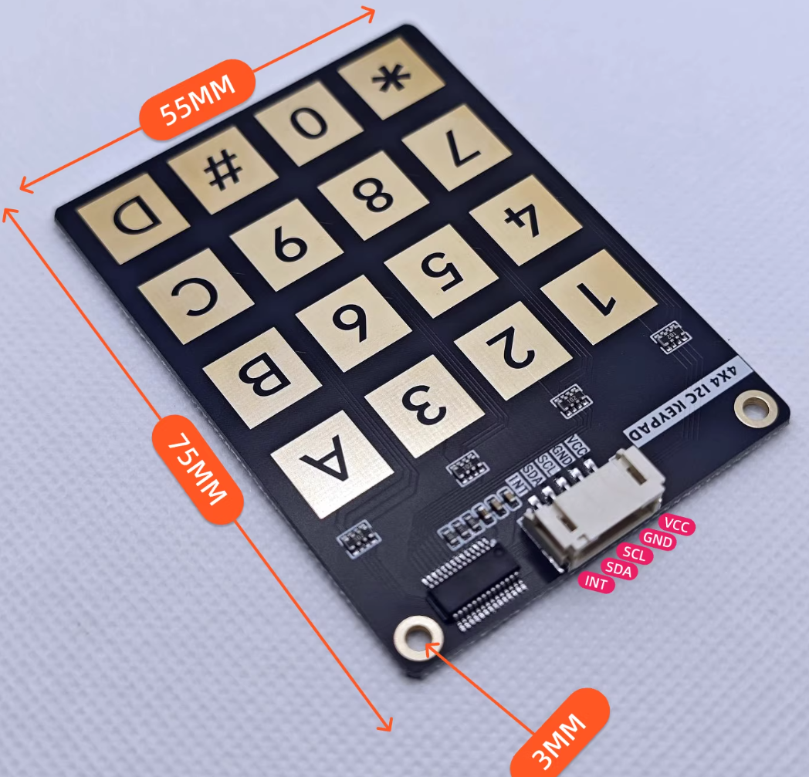

<p align="center">
    <br>
    <!--  -->
    <br>
<p>

<div align="center">

[](https://github.com/Nuliu-Z/keyboard-friend/blob/main/LICENSE)
[](https://GitHub.com/Nuliu-Z/keyboard-friend/pull/)
[](https://GitHub.com/Nuliu-Z/keyboard-friend/commit/)


<!-- [Discord](https://discord.gg/) -->


<h4 align="center">
    <p>
      <a href="https://github.com/Nuliu-Z/keyboard-friend/blob/main/README.md">English</a> |
        <b> 中文 </b>
    <p>
</h4>

</div>

# keyboard-friend · 一键触发你的命令

## 简介

这是一款极简实用的宏键盘。
如果要说它有什么特别，那就是：

- **配置友好** —— 无需安装任何驱动，上手即用
- **DIY 友好** —— 零件少、易采购、组装简单
- **系统通吃** —— 支持 Windows、Linux、Android

---

## 使用场景

- 输入游戏秘籍（初心所在，致敬老游戏）
- 快速输入密码
- 一键连招（理论可行，欢迎尝试）

---

## 设备与固件

有经验的朋友，建议购买配件搭建
想直接体验功能的朋友，建议购买成品（待推出），可以跳过“设备与固件”章节

| 配件                 | 说明                  | 价格（￥） |
| ------------------- | --------------------- | ---------- |
| 4×4 I2C 矩阵键盘     | 16键布局，支持I2C通信  | ≈14        |
| nRF52840 ProMicro    | 主控开发板            | ≈12        |
| USB Type-C 数据线    | 供电 + 数据传输        | -          |

注意：烧录固件另需 J-Link/DAPLink 等硬件设备

4×4 I2C 矩阵键盘



nRF52840 ProMicro


### 硬件接线

| 4×4 I2C 矩阵键盘 | nRF52840 ProMicro|
| -------- | ----- |
| VCC      | VCC   |
| GND      | GND   |
| SCL      | P0.27 |
| SDA      | P0.26 |
| INT      | 不连接 |

主机 USB 端口 <--USB线缆--> nRF52840 ProMicro Type-C

---

### 烧录固件

下载固件，通过 J-Link 烧录

如果对 J-Link 命令不熟悉，可以使用 [nRF Connect for Desktop(Programmer app)](https://docs.nordicsemi.com/bundle/swtools_docs/page/app/pc-nrfconnect-programmer/index.html)，或者直接问问AI :)

固件列表，见 [Release](https://github.com/Nuliu-Z/keyboard-friend/releases）。

## 快速开始

两步上手。

### 配置模式 —— 编辑配置文件，设定你需要输入的按键内容

连按3次`*`号键，触发模式切换。在“配置模式”下会在主机端识别为一个U盘设备，打开U盘，修改/创建 `config.json` 文件。

`config.json` 文件字段说明：
- `name`：配置文件描述，可任意填写
- `0-9, A-D, *, #`：映射到自定义字符串
  - 支持：字母（a-z, A-Z）、数字（0-9）、常见符号（- _ @ # $ % ^ & * 等）
  - 支持功能字符：`\n`（换行）、`\t`（制表）、`\b`（退格）
  - 不支持中文、日文、emoji 等多字节字符
  - 字符串长度 ≤ 64 字节
- 可存储多个备份配置文件（如 `config_mode1.json, config_mode2.json, ...`），只有 `config.json` 会被加载

示例
```json
{
    "name": "keypad_config_v1",
    "0": "hello 0",
    "1": "hello 1",
    "2": "hello 2",
    "3": "hello 3",
    "4": "hello 4",
    "5": "hello 5",
    "6": "hello 6",
    "7": "good 7",
    "8": "good 8",
    "9": "good 9",
    "A": "good A",
    "B": "good B",
    "C": "good C",
    "D": "good D",
    "*": "good *",
    "#": "good #"
}
```

### 工作模式 —— 连接设备，按下对应按键即可触发

连按3次`*`号键，触发模式切换。在“工作模式”下会在主机端识别为一个键盘设备，在文本输入位置按下按键即可输出对应内容。

---

## 模板配置

切换到“配置模式”下，拷贝配置到设备中并命名为“config.json”，然后切换到“工作模式”即可使用。

## 使用限制

- 不支持输入中文字符
- 不支持无线连接（需有线使用）

---

## 致谢 & 开源

项目初心致敬老游戏，欢迎 Fork 和 PR。
Apache License © 2026
